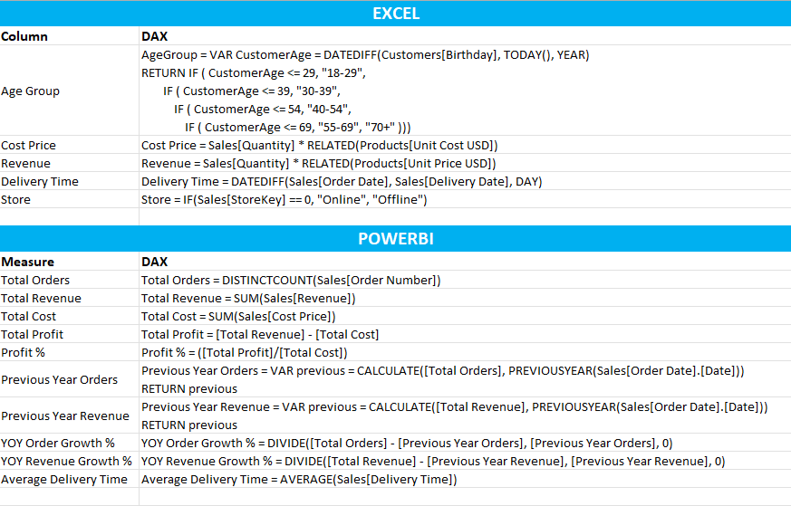

# Global Electronics Retailers Sales Dashboard

## Project Overview
This project is a sales dashboard that provides insights into sales performance, orders trend, product performance, stores performance, etc. It was created using Power BI for visualization and Excel for data cleaning.

## Key Features

__Sales Performance__: Analyze overall and segmented sales metrics.

__Orders Trend__: Track and visualize trends over time.

__Product Performance__: Identify top performing and underperforming products.

__Store Performance__: Compare and assess performance across multiple stores.

__Customer Demographics__: Visualize customer distribution by age, gender, and geographic location to uncover trends.

## Tools & Technologies
__Excel__: Data cleaning and preprocessing.

__Power BI__: Data visualization and dashboard creation.

## Dataset
The dataset used in this project is the Global Electronics Retailers Sales Data, sourced from Kaggle. It contains detailed information about sales, store operations, product details, and customer demographics. The data spans from 2016 to 2021, with only two months of data available for 2021. It consists of four CSV files:

- __Sales__: It contains 62,884 rows of data about order info such as date, order number, quantity.
- __Stores__: The dataset includes information on 67 stores, detailing attributes such as location and store area.
- __Products__: The dataset provides information on 2,517 unique products, including details such as price, brand, and category.
- __Customers__: The dataset contains 15,266 rows of customer information, including details such as city, date of birth (DOB), gender, and other relevant attributes.

## Data Structure

## Data Cleaning and Preparation
- Removed unnecessary columns, including 'Subcategory Key', 'Category Key', 'Zip Code', etc., to focus on relevant data.
- Eliminated duplicates to ensure data accuracy.
- Removed unwanted characters from 'State' column.
- Corrected the date format in 'Order Date' and 'Delivery Date' columns.

## Formulas used

## Key Insights

- Orders consistently peak in December, except for the year 2020, and consistently reach their lowest point in April.
- Online sales account for approximately 20% of overall orders, showing significant growth from 16% in 2016 to 27% in 2021.
- The United States contributes a massive 53.58% of revenue, overshadowing all other countries. 
- Desktops contribute the highest revenue, significantly outpacing other subcategories. Televisions and projectors are secondary drivers, but their revenue  is less than half of desktops.
- Older age groups (55-69 and 70+) dominate order percentages, accounting for ~30% of orders. The younger demographic (18-29) contributes the lowest share.

## How to use this dashboard

To view and interact with this dashboard, make sure you have Power BI Desktop installed. Then, download the .pbix file and open it in Power BI Desktop.

## Conclusion
In this Power BI dashboard project, I visualized sales performance data to create an interactive and user friendly dashboard. The data was initially cleaned and preprocessed using Excel, before importing it into Power BI. The dashboard highlights key sales metrics, including total revenue, revenue by brand, product performance, and customer segmentation.
The interactive features, such as slicers for filtering provide users with the ability to explore specific segments and gain actionable insights. This dashboard empowers stakeholders to monitor sales trends, identify underperforming products, and make data driven decisions to optimize sales strategies.
